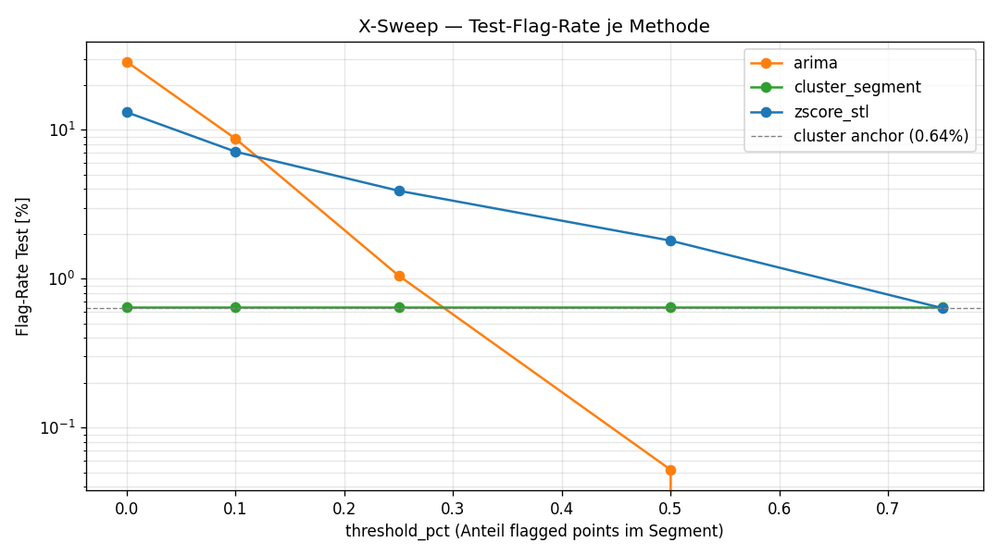
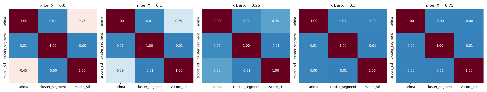

# KI-gestützte Anomalieerkennung in Smart-Meter-Daten

**Ensemble-Methoden und LLM-Handlungsempfehlungen für das Energiemanagement**

Felix Zorn · Jakob Ringel  
Modul „Nachhaltigkeit und Digitalisierung“ · Prof. Dr. M. Müßig  
Master Digital Business · FIW · Technische Hochschule Würzburg-Schweinfurt  
Juli 2026

> Markdown-Quelle des Papers (zum Editieren). Kanonische Abgabe ist `paper/paper.docx`; Zitate Author-Year aus `paper/references.bib`.

## 1 Einleitung

### 1.1 Hintergrund und Motivation

Die Energiewende verlagert einen wachsenden Teil der Steuerungslogik im Stromsystem von der Erzeugungs- auf die Verbrauchsseite. Mit dem „Gesetz zum Neustart der Digitalisierung der Energiewende“ (Bundesrepublik Deutschland, 2023) wird der flächendeckende Rollout intelligenter Messsysteme (Smart Meter) in Deutschland verbindlich vorangetrieben; auf europäischer Ebene fordert die novellierte Energieeffizienz-Richtlinie (European Parliament & Council, 2023) zusätzliche Effizienzanstrengungen. Gewerbliche Liegenschaften verfügen über registrierende Lastgangmessung (RLM), die den Leistungsbezug in 15-Minuten-Intervallen aufzeichnet. Diese Daten sind eine bislang wenig genutzte Ressource: Vermeidbarer Verbrauch – etwa durchlaufende Lüftung außerhalb der Betriebszeit – bleibt ohne systematische Analyse unsichtbar (BMWK, 2022; Bundesnetzagentur & Bundeskartellamt, 2024). Bei 15-minütiger Auflösung und einem Messzeitraum von drei Jahren entstehen je Standort rund 105.000 Werte; eine rein manuelle Sichtung dieser Datenmenge ist ausgeschlossen und verlangt nach automatisierten Verfahren.

### 1.2 Problemstellung

Was als „normaler“ Lastgang gilt, ist stark standort- und kategorieabhängig, und für reale Anomalien liegen keine gelabelten Trainingsdaten vor. Etablierte Verfahren setzen meist auf eine einzelne Detektionsmethode und überlassen die Interpretation dem Betriebspersonal. Für ein praxistaugliches Energiemanagement in kleinen und mittleren Unternehmen (KMU) fehlt damit zweierlei: eine empirisch begründete Methodenwahl und eine automatisierte Überführung der Befunde in konkrete Handlungsschritte. Erschwerend kommt hinzu, dass sich Verbrauchsmuster zwischen Nutzungskategorien – etwa Tankstellen, Bürogebäuden oder Baumärkten – grundlegend unterscheiden, sodass ein für eine Kategorie kalibriertes Modell nicht ohne Weiteres auf eine andere übertragbar ist.

### 1.3 Forschungsfrage und Beitrag

Vor diesem Hintergrund untersuchen wir die folgende Forschungsfrage: Wie lassen sich statistische, Deep-Learning- und LLM-basierte Methoden kombinieren, um Anomalien in Energie-Lastgängen zu erkennen und mit umsetzbaren Handlungsempfehlungen zu versehen? Unser Beitrag ist dreifach: (1) Wir vergleichen vier Detektionsmethoden empirisch auf realen RLM-Daten anhand von Komplementarität, Precision und Inferenzkosten. (2) Wir zeigen, dass die Methoden komplementär sind und sich zu einem Ensemble verbinden lassen. (3) Wir koppeln ein lokal betriebenes großes Sprachmodell (Large Language Model, LLM) an, das je Anomalie eine strukturierte, kontextbasierte Empfehlung erzeugt. Damit verstehen wir die Arbeit nicht als Vorschlag eines neuen Modells, sondern als Integration etablierter Verfahren zu einer für den Praxiseinsatz erklärbaren Pipeline.

### 1.4 Aufbau der Arbeit

Kapitel 2 ordnet die Arbeit in den Stand der Technik ein. Kapitel 3 beschreibt Daten, Methoden und die LLM-Pipeline. Kapitel 4 berichtet die Ergebnisse des Methodenvergleichs, Kapitel 5 diskutiert sie samt ihren Grenzen, und Kapitel 6 fasst zusammen.

## 2 Stand der Technik

### 2.1 Anomalieerkennung in Zeitreihen

Anomalieerkennung bezeichnet das Auffinden von Beobachtungen, die deutlich vom erwarteten Muster abweichen. Der vielzitierte Überblick von Chandola et al. (2009) unterscheidet Punkt-, Kontext- und Kollektiv-Anomalien – eine Taxonomie, die Blázquez-García et al. (2021) für Zeitreihen konkretisieren. Eine einfache, vollständig nachvollziehbare Baseline ist der Z-Score, der eine Abweichung in Einheiten der Standardabweichung misst. Voraussetzung ist ein um Saisonalität bereinigtes Signal. Hierfür nutzen wir die STL-Zerlegung (Seasonal-Trend decomposition using Loess) nach Cleveland et al. (1990), die eine Reihe additiv in Trend-, Saison- und Restkomponente zerlegt. Forecasting-basierte Verfahren erkennen Anomalien dagegen als Abweichung von einer Vorhersage; das klassische ARIMA-Modell (AutoRegressive Integrated Moving Average) nach Box et al. (2015) liefert dafür Prognose und Prädiktionsintervall (Hyndman & Athanasopoulos, 2021). Frühe Übersichten klassischer Detektionstechniken geben Patcha & Park (2007).

### 2.2 Clustering-basierte Verfahren

Distanzbasierte Ansätze gruppieren typische Verbrauchsmuster und bewerten die Distanz einer Beobachtung zum nächsten Cluster-Zentrum als kontinuierliches Anomaliesignal. Aghabozorgi et al. (2015) geben einen Überblick über Zeitreihen-Clustering. In unserer Pipeline übernimmt das Clustering zwei getrennte Rollen, die wir in Kapitel 3 erläutern. Der Vorteil distanzbasierter Signale liegt darin, dass sie kontinuierlich sind und sich damit unmittelbar neben Residuen oder Rekonstruktionsfehlern in einen Methodenvergleich stellen lassen.

### 2.3 Deep Learning für Anomalieerkennung

Mit wachsender Datenverfügbarkeit haben sich Deep-Learning-Methoden etabliert (Pang et al., 2021; Chalapathy & Chawla, 2019). Autoencoder lernen, ein Eingangssignal über einen Engpass zu rekonstruieren; ein hoher Rekonstruktionsfehler zeigt eine untypische Beobachtung an. Malhotra et al. (2016) übertragen dieses Prinzip mit einem LSTM-Encoder-Decoder auf multivariate Sensordaten. Für den Energiekontext fassen Himeur et al. (2021) KI-basierte Verfahren zur Anomalieerkennung des Gebäudeverbrauchs zusammen. Umfassende Benchmarks zeigen jedoch, dass kein Verfahren über alle Datensätze hinweg dominiert (Schmidl et al., 2022) – ein zentrales Argument für einen empirischen Methodenvergleich statt einer Vorab-Festlegung. Für die Verbrauchsanalyse sind rekonstruktionsbasierte Modelle besonders attraktiv, da sie ohne Anomalie-Labels auskommen und allein aus dem Normalbetrieb lernen.

### 2.4 Sprachmodelle und strukturierte Ausgabe

Große Sprachmodelle lösen Aufgaben zunehmend über wenige Beispiele im Prompt (Few-Shot-Learning), ohne erneutes Training (Brown et al., 2020). Offen verfügbare Modelle wie Qwen 2.5 (Qwen Team, 2024) lassen sich lokal betreiben, was Datenschutz und Energieverbrauch begünstigt. Für die maschinelle Weiterverarbeitung ist entscheidend, dass die Ausgabe einem festen Schema folgt; grammatik-beschränktes Decoding erzwingt valide JSON-Strukturen (Willard & Louf, 2023). Einen breiteren Überblick zu Sprachmodellen und ihren Anwendungen geben Minaee et al. (2024).

### 2.5 Forschungslücke

Klassische Detektoren, Deep-Learning-Verfahren und LLM-Anwendungen existieren je für sich. Eine integrierte Pipeline, die ein komplementäres Methoden-Ensemble mit einer lokalen LLM-Empfehlungsschicht für KMU-Energieanwendungen verbindet, ist in der Literatur nicht standardmäßig vertreten. Genau hier setzt unsere Arbeit an.

## 3 Methodik

### 3.1 Datengrundlage

Unsere Datenbasis umfasst RLM-Lastgänge von 22 Baumarktfilialen eines deutschen Einzelhandelsunternehmens sowie einer zusätzlichen Filiale, die als Sonderfall geführt wird (Abschnitt 3.2). Die Daten wurden uns von einem Industriepartner aus dem Energiebereich bereitgestellt. Jede Filiale liegt als separate Datei mit Zeitstempel und Leistungswert in Kilowatt vor; die zeitliche Auflösung beträgt 15 Minuten, was rund 105.000 Messpunkte pro Standort und Jahr ergibt. Der erfasste Zeitraum reicht von Januar 2023 bis etwa März 2026. Die Daten liegen in lokaler Zeit (Europe/Berlin) vor und enthalten die für die Sommerzeitumstellung typischen Lücken bzw. Dopplungen, die der Loader tolerant behandelt. Metadaten zum Standort fehlen; insbesondere liegen keine Postleitzahlen vor, was für die Wetteranreicherung relevant ist (Abschnitt 3.5). Die Leistungswerte rechnen wir je Intervall in Energie um (Energie in kWh = Leistung in kW × 0,25). Der hier ausgewertete Datensatz umfasst ausschließlich Baumärkte; die Architektur ist jedoch so angelegt, dass je Kategorie eigene Modelle trainiert werden können.

### 3.2 Studiendesign

Wir trennen die Daten zeitlich: Beobachtungen vor dem 1. Januar 2025 dienen dem Training, ab diesem Stichtag der Auswertung. Eine Filiale beginnt erst 2025 und besitzt damit keinen Trainingszeitraum; wir weisen sie durchgängig als Sonderfall (Risiko von Information-Leakage) aus und behandeln sie für alle Methoden einheitlich.

### 3.3 Vier Detektionsmethoden

Wir vergleichen vier Methoden, die bewusst unterschiedliche Signalfamilien adressieren – Punkt- und Niveauabweichungen einerseits, Formabweichungen des Tagesverlaufs andererseits. Der Z-Score auf dem STL-Residual bildet die Baseline: Wir zerlegen jede Reihe per STL (Tagesperiode von 96 Intervallen) und kennzeichnen Werte des Residuums jenseits von 3,0 Standardabweichungen als Punkt-Ausreißer. Die Methode ist transparent und nahezu kostenlos. Das ARIMA-Verfahren steht für klassisches Forecasting: Da ein Modell je Einzelzähler nicht skaliert, fassen wir Standorte über ihre mittleren Tagesprofile zu Peer-Gruppen (k = 3) zusammen und trainieren je Gruppe ein Modell. ARIMA arbeitet auf der saisonbereinigten Reihe (Trend plus Rest), nicht auf dem reinen Residuum, um echte Restdynamik statt weißes Rauschen zu modellieren; gesetzliche Feiertage gehen als exogene Variable ein, da sich an ihnen empirisch eine erhöhte Abweichungsrate zeigt. Eine relative Forecast-Abweichung über 3,0 Sigma markiert eine Anomalie. Die Wahl von drei Peer-Gruppen orientiert sich an der Ähnlichkeit der mittleren Tagesprofile. An gesetzlichen Feiertagen liegt die Abweichungsrate im Mittel rund doppelt so hoch wie an regulären Tagen; die STL absorbiert diese irregulären Tage nicht vollständig, weshalb der Feiertagskalender als exogene Größe gerechtfertigt ist.

Die Cluster-Distanz arbeitet auf Segment-Tag-Profilen: Wir teilen den Tag in vier Segmente (nachts, vormittag, mittag, nachmittag) und clustern je Segment die aggregierten Tagesprofile. Die standardisierte Distanz zum nächsten Cluster-Zentrum ist das Anomaliesignal; die Schwelle ergibt sich aus dem 99. Perzentil der Trainingsdistanzen. Diese Schicht arbeitet methoden-agnostisch und benennt zugleich die betroffene Tageszeit. Das Clustering erfüllt damit zwei Rollen: Es liefert die Peer-Gruppen für ARIMA und zugleich die Diagnose-Schicht für alle Methoden. Der Autoencoder (in einer Dense- und einer LSTM-Variante) wird je Kategorie trainiert: Er erhält den rohen 24-Stunden-Lastgang (96 Werte) und lernt, ihn zu rekonstruieren. Wir normieren pro Standort, sodass sowohl die Tagesform als auch ein dauerhaft erhöhtes Niveau erfasst werden; der Rekonstruktionsfehler dient als Score. Punktbasierte Flags aggregieren wir schließlich auf Segment-Tag-Ebene über einen Anteilsparameter X, den wir anhand eines Sweeps (Kapitel 4) auf 0,25 setzen. Die vier Methoden bringen damit komplementäre Stärken und Schwächen mit: Der Z-Score ist transparent und schnell, erfasst aber Niveau-Drift schlecht; ARIMA bildet lokale Prognoseabweichungen ab, reagiert jedoch empfindlich auf Verzerrungen im Training und ist rechenintensiv; die Cluster-Distanz ist robust und diagnosenah, lokalisiert eine Anomalie aber nur auf Segment-Ebene; der Autoencoder erfasst Form- und Niveauabweichungen im Tagesverlauf, kann aber unvollständige Tage – etwa an den Zeitumstellungen – nicht bewerten.

### 3.4 Plausibilitäts-Annotation

Mangels gelabelter Anomalien bewerteten beide Autoren die jeweils stärksten Kandidaten je Methode manuell. Insgesamt 66 Kandidaten wurden auf einer dreistufigen Plausibilitätsskala (plausibel anomal, unklar, nicht anomal) eingestuft. Alle 66 erreichten im Konsens beider Reviewer die Einstufung „plausibel anomal“, einschließlich der neun Kandidaten, die ausschließlich der Autoencoder meldete. Aus diesen Urteilen schätzen wir die Precision je Methode auf ihren Top-Kandidaten. Jeder Kandidat wurde dafür als Lastgang-Ausschnitt visualisiert, sodass beide Reviewer auf derselben visuellen Grundlage urteilten.

### 3.5 LLM-Pipeline

Jede bestätigte Anomalie wird in eine strukturierte Handlungsempfehlung überführt. Wir betreiben das Modell Qwen 2.5 7B lokal über Ollama (Temperatur 0,2, fester Seed). Die Ausgabe wird per JSON-Grammatik erzwungen und anschließend programmseitig validiert. Als Systemprompt wählten wir nach einem qualitativen Variantenvergleich eine Few-Shot-Variante, die milde Minderlasten korrekt als möglichen Effizienzgewinn statt als Defekt einordnet und kalibrierte Konfidenzwerte liefert (Brown et al., 2020; Willard & Louf, 2023). Von drei verglichenen Prompt-Varianten erzeugte allein diese durchgängig wohlgeformte und domänenspezifische Ausgaben; eine minimalistische Variante lieferte vereinzelt abgeschnittene und überkonfidente Empfehlungen und schied aus. Ein deterministischer Kontext-Builder reichert jede Anomalie mit berechneten Fakten an, die das Modell nicht schätzen muss: aktuelle und erwartete Last (Median desselben Wochentags und derselben Uhrzeit über sieben Vorwochen), standortgenaues Wetter des Deutschen Wetterdienstes (eine Reihe je Standort am PLZ-Centroid), den Day-Ahead-Spotpreis sowie die im Code berechneten Mehrkosten (Leistungsdifferenz × Dauer × Preis). Das Ausgabeschema umfasst Schweregrad, vermutete Ursache, genau drei priorisierte Handlungsempfehlungen und einen Konfidenzwert.

### 3.6 Qualitätssicherung und Bewertungsmetriken

Die generierten Empfehlungen prüften die Autoren qualitativ auf Plausibilität (Domänenbezug, Konsistenz mit dem Anomalietyp, Umsetzbarkeit der Maßnahmen); eine systematische quantitative Bewertung erfolgte nicht. Zur Methodenbewertung verwenden wir Cohen’s κ (Cohen, 1960), ein etabliertes Maß für die Übereinstimmung kategorialer Bewertungen, um die Komplementarität der vier Methoden zu quantifizieren, ergänzt um Precision, Flag-Rate und Inferenzzeit. Ein interaktives Dashboard (umgesetzt als Web-Anwendung) dient der Stakeholder-Visualisierung und ist Belegmaterial, nicht Gegenstand der Bewertung.

### 3.7 Reproduzierbarkeit

Alle Verfahren sind mit festen Zufalls-Seeds implementiert. Die externen Kontextdaten – Wetter und Day-Ahead-Strompreis – werden über öffentliche Schnittstellen bezogen und monatsweise zwischengespeichert; Rohdaten werden nicht überschrieben, sodass wiederholte Pipeline-Läufe aus dem Cache lesen und identische Ergebnisse liefern.

## 4 Ergebnisse

### 4.1 Methodenvergleich

Tabelle 1 fasst den Vergleich zusammen. Alle vier Methoden erreichen auf ihren annotierten Top-Kandidaten eine Precision von 100 %; sie unterscheiden sich jedoch deutlich in der Flag-Rate im Testzeitraum. Die Cluster-Distanz flaggt mit 0,64 % am sparsamsten, gefolgt von ARIMA (1,05 %) und Autoencoder (1,21 %); der Z-Score liegt mit 3,90 % erkennbar höher und streut Flags breiter über die Anomalieperiode. Bemerkenswert ist, dass die durchweg hohe Precision die Methoden nicht trennt – jede liefert auf ihren stärksten Kandidaten plausible Anomalien, sodass die eigentliche Unterscheidung über Komplementarität und Kosten erfolgen muss.

| Methode | Flag-Rate Test | Precision | κ (max.) | fit (s) | score (s) |
|---|---|---|---|---|---|
| Z-Score (STL-Residual) | 3,90 % | 100 % | 0,08 | ~0 | ~0 |
| ARIMA (pro Cluster) | 1,05 % | 100 % | 0,11 | 118,4 | 50,1 |
| Cluster-Distanz (Segment) | 0,64 % | 100 % | 0,03 | 1,4 | 0,01 |
| Autoencoder (Dense+LSTM) | 1,21 % | 100 % | 0,11 | 5,2 | 3,2 |

*Tabelle 1: Methodenvergleich im Testzeitraum (ab 2025). Precision auf den annotierten Top-Kandidaten je Methode; κ (max.) ist die höchste paarweise Übereinstimmung; Laufzeiten je fünf Standorte. Eigene Darstellung.*

### 4.2 Wahl der Aggregationsschwelle

Ein Sweep über den Anteilsparameter X zeigt einen klaren Arbeitspunkt (Abbildung 2). Bei X = 0 – jede Punktmethode flaggt – steigen ARIMA auf 28,6 % und Z-Score auf 13,1 %, was operativ nicht handhabbar ist. Bei X = 0,25 liegen ARIMA (Faktor 1,64) und Autoencoder (Faktor 1,89) im Zielband des Cluster-Ankers (0,64 %), während der Z-Score mit Faktor 6,1 aufgebläht bleibt. Wir wählen X = 0,25 und weisen die breitere Streuung des Z-Scores als eigenständigen Befund aus. Dass kein einziger Schwellwert alle drei Punktmethoden gleichzeitig auf die Rate des Cluster-Ankers kalibriert, ist selbst ein Befund: Der Z-Score erzeugt pro Segment systematisch breitere Punkt-Anomalien als ARIMA und Autoencoder.

*Abbildung 2: Flag-Rate je Methode über den Aggregationsparameter X. Eigene Darstellung.*

### 4.3 Komplementarität der Methoden

Die paarweise Übereinstimmung der Methoden ist durchweg gering (Abbildung 1). Der höchste Wert beträgt κ = 0,11 zwischen ARIMA und Autoencoder; alle sechs Paare liegen deutlich unter der üblichen Schwelle von 0,40. Gleiche Eingangssignale – Autoencoder und Cluster auf der Tagesform, Z-Score und ARIMA auf dem Residuum – erklären die geringe Restkorrelation, wobei der Autoencoder als schwache Brücke zur Forecast-Familie wirkt. Praktisch bedeutet das, dass die Methoden weitgehend unabhängige Anomalien finden; jede betrachtet das Signal aus einem anderen Blickwinkel.

*Abbildung 1: Paarweise Methodenübereinstimmung (Cohen’s κ) über den Aggregations-Sweep. Eigene Darstellung.*

### 4.4 Inferenzkosten

Die Methoden unterscheiden sich stark im Rechenaufwand (Tabelle 1). Z-Score und Cluster-Distanz sind nahezu kostenlos; der Autoencoder benötigt rund fünf Sekunden Training und drei Sekunden Bewertung je fünf Standorte. ARIMA dominiert mit etwa 118 Sekunden Training und 50 Sekunden Bewertung die Gesamtkosten. Überraschend ist, dass der Autoencoder rund zwanzigmal schneller arbeitet als ARIMA – die verbreitete Intuition „Deep-Learning ist teuer“ trifft in dieser Aufgabengröße nicht zu. Für ein Dashboard heißt das, dass nur ARIMA vorberechnet werden muss, während die übrigen Methoden bei Bedarf neu laufen können.

### 4.5 Drift-Sensitivität des Autoencoders

Der Autoencoder ist die einzige Methode mit einer höheren Flag-Rate im Test als im Training (1,21 % gegenüber 0,89 %). Wir lesen dies als Hinweis auf eine Verhaltensdrift der Standorte zwischen 2023/24 und 2025, die durch die pro-Standort-Normierung sichtbar wird, während die übrigen Methoden sie eher glätten.

### 4.6 LLM-Pipeline

Über alle 66 bestätigten Anomalien erzeugte die Pipeline fehlerfrei strukturierte Empfehlungen: 66 von 66 erfolgreich, keine Wiederholungen, keine Schemafehler. Die Gesamtlaufzeit betrug 7:23 Minuten, im Mittel 6,7 Sekunden je Anomalie bei warmem Modell. Die Schweregrade verteilen sich auf hoch (31), mittel (25) und niedrig (10), was gegen eine pauschale Hochstufung spricht. Die mittlere Modellkonfidenz differenziert leicht zwischen den Methoden (Tabelle 2): Sie ist bei der Z-Score-Methode am höchsten (0,835) und bei ARIMA am niedrigsten (0,818); diese Konfidenz bezieht sich auf das Empfehlungsmodell, nicht auf den Detektor. Die Unterschiede sind klein (0,818–0,835); die nuancierteren Forecast-Abweichungen von ARIMA stuft das Modell tendenziell als weniger eindeutig ein als die deutlich ausgeprägten Punkt- und Tagesform-Anomalien.

| Methode | n | Konfidenz (Mittel) | Bereich |
|---|---|---|---|
| Z-Score | 20 | 0,835 | 0,80–0,85 |
| ARIMA | 17 | 0,818 | 0,75–0,85 |
| Cluster-Distanz | 20 | 0,822 | 0,75–0,85 |
| Autoencoder | 9 | 0,828 | 0,80–0,85 |

*Tabelle 2: Mittlere Modellkonfidenz der LLM-Empfehlungen je Detektionsmethode. Eigene Darstellung.*

Als Beispiel meldete die Cluster-Distanz an einem Standort (Baumarkt_03) in der Nacht eine Last von 72,6 kW gegenüber einer erwarteten Last von 8,0 kW (+807 %), mit geschätzten Mehrkosten von 31,35 € über rund sechs Stunden. Das Modell stufte den Fall als hoch ein (Konfidenz 0,85) und führte ihn auf eine nicht eingehaltene Nachtabsenkung der Lüftungs- und Klimatechnik zurück, mit drei priorisierten Prüfschritten. Die qualitative Sichtung aller Empfehlungen ergab durchgängig nachvollziehbare, zum Baumarkt-Kontext passende Vorschläge.

### 4.7 Operative Anomalie-Mengen

Die Flag-Raten übersetzen sich bei großen Standorten in operativ relevante Mengen – für eine einzelne Filiale etwa in der Größenordnung von 240 Z-Score-Meldungen je Monat. Über einen Schwellwert-Regler lassen sich die vorberechneten Scores ohne erneute Inferenz auf ein für das Review-Team handhabbares Volumen reduzieren; eine produktive Pipeline würde die Meldungen zusätzlich nach Schweregrad und Ensemble-Überlappung priorisieren.

## 5 Diskussion

### 5.1 Ensemble statt Einzelsieger

Der zentrale Befund ist das Ausbleiben eines klaren Gewinners. Da alle Methoden eine hohe Precision erreichen und zugleich paarweise nahezu unkorreliert sind (κ ≈ 0), detektieren sie überwiegend disjunkte Anomaliemengen. Eine niedrige Übereinstimmung bei gleichzeitig hoher Einzel-Precision ist genau die Konstellation, in der ein Vereinigungs-Ensemble (Union) sinnvoll ist: Es summiert komplementäres statt redundantes Wissen und hält die Rate übersehener Anomalien niedrig. Für ein Dashboard, das jede Meldung einer Sichtung zuführt, ist die Union die naheliegende Standardwahl; eine Mehrheitsentscheidung liefe bei κ ≈ 0 dagegen nahezu leer. Die Entscheidung zwischen Union und Mehrheitsvotum ist letztlich eine Frage des Betriebsmodells: Wo jede Meldung ohnehin gesichtet wird, überwiegt die Sensitivität der Union; wo automatisch und ohne Sichtung berichtet wird, kann ein konservativeres Votum sinnvoll sein.

### 5.2 Mehrwert der LLM-Schicht

Die LLM-Schicht erweitert die reine Detektion um den entscheidenden nächsten Schritt: eine strukturierte, sofort lesbare Handlungsempfehlung samt Kontext. Dass alle Zahlen – Last, Mehrkosten, Wetter, Preis – deterministisch im Code berechnet und dem Modell nur vorgelegt werden, begrenzt das Risiko halluzinierter Werte; die fehlerfreie Schemaquote bestätigt die Praxistauglichkeit der grammatik-beschränkten Ausgabe. Da das Modell lokal läuft, verbleiben sensible Verbrauchsdaten im Haus, und es entsteht kein zusätzlicher Cloud- oder Trainingsenergieverbrauch – ein bewusster Beitrag zur Nachhaltigkeit der Lösung (im Sinne der Ziele für nachhaltige Entwicklung SDG 7 und SDG 9). Zugleich verbraucht die Pipeline selbst Energie; der bewusste Verzicht auf Cloud-Inferenz und zusätzliches Modelltraining ist daher Teil einer ehrlichen Bilanz zwischen dem Nutzen der Analyse und ihrem eigenen Ressourceneinsatz.

### 5.3 Grenzen

Mehrere Einschränkungen sind zu nennen. Erstens neigt das Modell bei mehrdeutigen Anomalien dazu, Fehler in der Klima-, Lüftungs- oder Beleuchtungssteuerung als Standardhypothese zu nennen; diese Vorschläge sind als Prüf-Aufträge an das Facility-Management zu verstehen, nicht als verifizierte Diagnosen. Zweitens beziehen wir Wetterdaten mangels Standort-Postleitzahlen aus einer einzigen Referenzstation, was regionale Unterschiede nivelliert. Drittens prüften wir die Empfehlungen nur qualitativ; eine systematische, skalenbasierte Bewertung durch mehrere Gutachter steht aus. Viertens erfolgte der Methodenvergleich innerhalb einer Kategorie (Baumärkte), und die Precision-Schätzung beruht auf den jeweils stärksten Kandidaten – sie sagt nichts über übersehene Anomalien (False Negatives) aus. Schließlich bleibt die als Sonderfall geführte Filiale ohne echten Trainingszeitraum ein methodischer Vorbehalt, den wir transparent ausweisen.

### 5.4 Ausblick

Die Architektur ist generisch angelegt und auf weitere Kategorien wie Tankstellen oder Bürogebäude übertragbar, sofern je Kategorie neu trainiert und re-kalibriert wird. Sinnvolle Folgeschritte sind eine quantitative Qualitätsbewertung der Empfehlungen sowie eine Priorisierung der Meldungen nach Schweregrad und Ensemble-Überlappung. Mittelfristig erlaubt die modulare Trennung von Detektion, Diagnose und Empfehlung, einzelne Komponenten unabhängig auszutauschen – etwa den Detektor zu ersetzen, ohne die Empfehlungsschicht anzupassen.

## 6 Fazit

Wir entwickelten eine kombinierte Pipeline aus vier statistischen und Deep-Learning-Methoden zur Anomalieerkennung in Smart-Meter-Lastgängen, ergänzt um eine lokal betriebene LLM-Komponente zur Erzeugung von Handlungsempfehlungen. Die vier Methoden erwiesen sich als komplementär (κ ≈ 0 paarweise) bei durchgängig hoher Precision, was den Einsatz eines Ensemble-Ansatzes nahelegt; die LLM-Pipeline erzeugte für alle 66 bestätigten Anomalien fehlerfrei strukturierte, plausible Empfehlungen. Die generische Pipeline-Architektur ermöglicht als Folgeschritt die Übertragung auf weitere Industriekategorien sowie eine systematische Qualitätsbewertung der Empfehlungen im Produktivbetrieb.

## Literaturverzeichnis

- Aghabozorgi, S., Shirkhorshidi, A. S., & Wah, T. Y. (2015). Time-series clustering – A decade review. Information Systems, 53, 16–38.
- Blázquez-García, A., Conde, A., Mori, U., & Lozano, J. A. (2021). A review on outlier/anomaly detection in time series data. ACM Computing Surveys, 54(3), 1–33.
- Box, G. E. P., Jenkins, G. M., Reinsel, G. C., & Ljung, G. M. (2015). Time series analysis: Forecasting and control (5th ed.). Wiley.
- Brown, T. B., Mann, B., Ryder, N., Subbiah, M., Kaplan, J., Dhariwal, P., … Amodei, D. (2020). Language models are few-shot learners. Advances in Neural Information Processing Systems, 33, 1877–1901.
- Bundesministerium für Wirtschaft und Klimaschutz. (2022). Energieeffizienz in Zahlen: Entwicklungen und Trends in Deutschland 2022. BMWK.
- Bundesnetzagentur, & Bundeskartellamt. (2024). Monitoringbericht 2024. Bundesnetzagentur.
- Bundesrepublik Deutschland. (2023). Gesetz zum Neustart der Digitalisierung der Energiewende (GNDEW). Bundesgesetzblatt 2023 I Nr. 133.
- Chalapathy, R., & Chawla, S. (2019). Deep learning for anomaly detection: A survey. arXiv:1901.03407.
- Chandola, V., Banerjee, A., & Kumar, V. (2009). Anomaly detection: A survey. ACM Computing Surveys, 41(3), 1–58.
- Cleveland, R. B., Cleveland, W. S., McRae, J. E., & Terpenning, I. (1990). STL: A seasonal-trend decomposition procedure based on loess. Journal of Official Statistics, 6(1), 3–73.
- Cohen, J. (1960). A coefficient of agreement for nominal scales. Educational and Psychological Measurement, 20(1), 37–46.
- European Parliament, & Council of the European Union. (2023). Directive (EU) 2023/1791 on energy efficiency (recast). Official Journal of the EU, L 231.
- Himeur, Y., Ghanem, K., Alsalemi, A., Bensaali, F., & Amira, A. (2021). Artificial intelligence based anomaly detection of energy consumption in buildings: A review, current trends and new perspectives. Applied Energy, 287, 116601.
- Hyndman, R. J., & Athanasopoulos, G. (2021). Forecasting: Principles and practice (3rd ed.). OTexts.
- Malhotra, P., Ramakrishnan, A., Anand, G., Vig, L., Agarwal, P., & Shroff, G. (2016). LSTM-based encoder-decoder for multi-sensor anomaly detection. ICML 2016 Anomaly Detection Workshop. arXiv:1607.00148.
- Minaee, S., Mikolov, T., Nikzad, N., Chenaghlu, M., Socher, R., Amatriain, X., & Gao, J. (2024). Large language models: A survey. arXiv:2402.06196.
- Pang, G., Shen, C., Cao, L., & van den Hengel, A. (2021). Deep learning for anomaly detection: A review. ACM Computing Surveys, 54(2), 1–38.
- Patcha, A., & Park, J.-M. (2007). An overview of anomaly detection techniques: Existing solutions and latest technological trends. Computer Networks, 51(12), 3448–3470.
- Qwen Team. (2024). Qwen2.5 technical report. arXiv:2412.15115.
- Schmidl, S., Wenig, P., & Papenbrock, T. (2022). Anomaly detection in time series: A comprehensive evaluation. Proceedings of the VLDB Endowment, 15(9), 1779–1797.
- Willard, B. T., & Louf, R. (2023). Efficient guided generation for large language models. arXiv:2307.09702.

*Hinweis: Eine Erklärung zur Nutzung von KI-Werkzeugen wird durch die Autoren gesondert beigefügt.*
